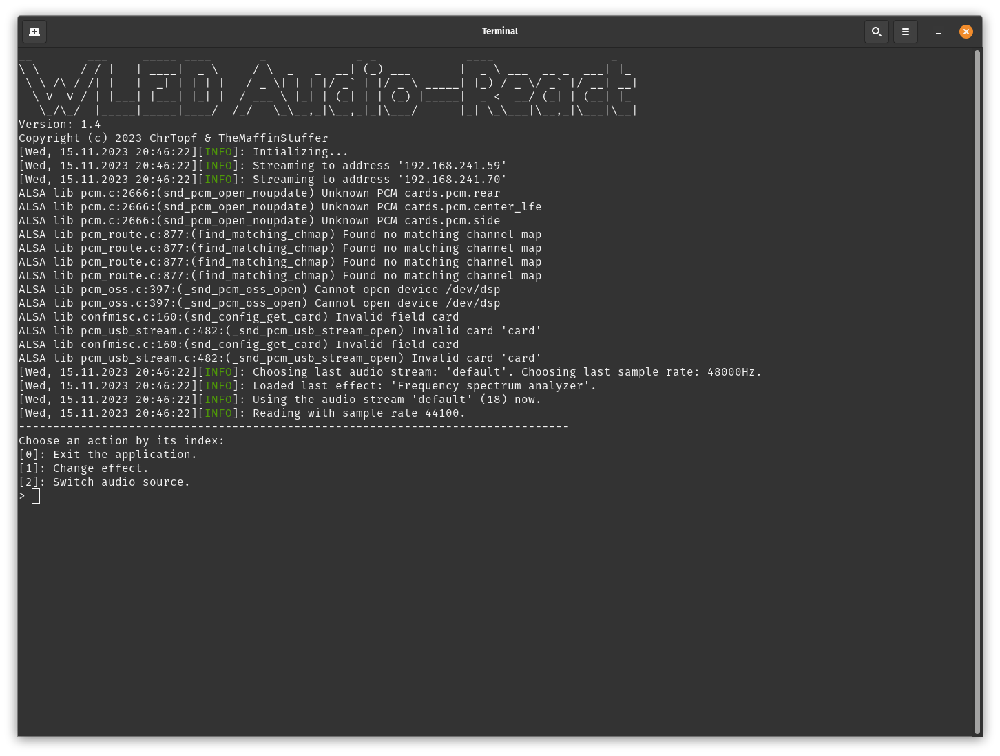

# wled-audioreact

This application generates cool light effects for your [WLED](https://kno.wled.ge/) driven strips based on the music currently playing on your computer. You can choose from multiple effects and audio sources, adding another dimension to your music listening experience.

## ! Warning !

**This application can potentially trigger seizures for people with photosensitive epilepsy.**

## License

This software is licensed under the GNU General Public License v3.0.

By using this software you automatically agree to its license.

For further licensing information, please have a look at [LICENSE](LICENSE).

## Requirements

- n WLED clients with one LED strip each. Each LED strip should have an equal amount of LEDs.

- Reliable IPv4 UDP communication between the computer and the [WLED](https://kno.wled.ge/) clients on port 21324. For further reference on the interface between this application and WLED have a look at the [WLED Documentation](https://kno.wled.ge/interfaces/udp-realtime/).

- x86_64 CPU architecture

- GNU/Linux or Microsoft Windows operating system

## Installation/Usage

1. Copy the compiled application **and its settings file** into a directory of your choice.

2. Configure everything in the settings file. See [Configuration](#Configuration) section for more information.

3. Start the application over the command line, choose an audio stream as input and one of the effects.

## Effects

| Description                                                                                                                                                                                                                        | Preview                      |
| ---------------------------------------------------------------------------------------------------------------------------------------------------------------------------------------------------------------------------------- | ---------------------------- |
| A rudimentary average volume slider. Indicates the average value of all recorded audio samples. (With color cycle)                                                                                                                 | https://youtu.be/dKLQ1E0vICo |
| True RMS volume slider with maximum volume tip. An average volume slider with RMS values and a different colored tip to indicate the peaks. (With color cycle)                                                                     | https://youtu.be/XVBKG4giQXc |
| A basic maximum volume slider. Indicates the maximum value of all recorded audio samples. (With color cycle)                                                                                                                       | https://youtu.be/GHFU9uqTnNY |
| Stroboscopic white light reacting to the frequencies of rock music. Each time a base or drum sounds the whole LED Stripe flashes in white.                                                                                         | https://youtu.be/slSAnZhB0bI |
| Frequency spectrum analyzer. Visualizes the frequencies in the music by using a iron color pallette (like thermal imaging camera) and the discrete fourier transform. (z-transform) The first LED represents the lowest frequency. | https://youtu.be/G9idCGDR-Lc |
| Frequency spectrum analyzer for low frequencies. Same as above without scaling the result and focusing on the lower frequencies.                                                                                                   | https://youtu.be/Tq3pwMvruTA |
| Stroboscopic white light reacting to the frequencies of electronic music. Each time a base sounds the whole LED Stripe flashes in white.                                                                                           | https://youtu.be/iOoDIP9EUwo |
| Stroboscopic white light reacting to RMS peak volume. Reacts to peaks in volume and flashes the whole LED Stripe in white.                                                                                                         | https://youtu.be/PktWWTVJIds |

## Configuration

The configuration file `settings.json` contains the following entries:

| Setting           | Example Value(s)                                       | Description                                                                                                                                                                                                                                                                                             |
| ----------------- | ------------------------------------------------------ | ------------------------------------------------------------------------------------------------------------------------------------------------------------------------------------------------------------------------------------------------------------------------------------------------------- |
| `addressees`      | `"0":"192.168.178.37",` `"1":"192.168.178.33"` | A List of IPv4 adresses of the WLED clients. The first key must be 0. Each client is going to receive the same information to be displayed.                                                                                                                                                             |
| `audioStream`     | `"spotify"`                                            | The name of the currently chosen audio stream. Can be left empty, as this is modified by the application.                                                                                                                                                                                               |
| `sampleRate`      | `44100`                                                | The sample rate or sample size, with which the audio stream is red. Choosing the standard sample rate of an audio stream is recommended. Can be left empty, as this is modified by the application.                                                                                                     |
| `effectIndex`     | `0`                                                    | The index of the currently chosen effect. Can be left empty, as this is modified by the application.                                                                                                                                                                                                    |
| `ledAmount`       | `144`                                                  | The amount of LEDs controlled by each WLED client. If you have clients with 144 LEDs each, this parameter should be 144. Only linear (one dimensional) LED stripes are supported. No LED matrices or LED cubes. For setups with multiple stripe Lengths, this should be the length of the smallest one. |
| `loglevel`        | `1`                                                    | The level, that determines which log messages are printed. This parameter specifies the lowest level to be printed. `0` : Debug `1` : Info `2` : Warning `3` : Error                                                                                                                    |
| `streamBlacklist` | `"0": "upmix",` `"1": "vdownmix"`                  | A list of audio stream names, that should not be selected by this application. This needs to be configured manually.                                                                                                                                                                                    |

## Build your own wled-audioreact driven LED Stripes

We recommend the [getting started guide](https://kno.wled.ge/basics/getting-started/) from WLED to build your very own stripe.

Have a look at the [parts list](hardware/PARTS_LIST.md) provided by this repository to find out how we did it.

Our schematics and 3D Models are also provided in the `hardware/` directory of this repository.

## Developer Notes

- Open the `src/` directory as a project in your IDE.

- The recommended IDE for development is CLion.

- In Order to build the application you need to install all necessary dependencies first.

- When implementing a new effect, do not forget to add it in the Effects.h!

### Dependencies

| Name                                       | Version    | Installation                                                                                                                            |
| ------------------------------------------ | ---------- | --------------------------------------------------------------------------------------------------------------------------------------- |
| [nlohmann JSON](https://json.nlohmann.me/) | >= v3.11.2 | Located in dependencies directory and automatically found by CMake.                                                                     |
| [PortAudio](http://www.portaudio.com/)     | >= v19.7.0 | Linux: `sudo apt install portaudio19-dev` Windows: PortAudio is not required for the Windows build. WASAPI is used instead. |
| [ASIO](https://think-async.com/Asio/)      | >= v1.28.0 | Located in dependencies directory and automatically found by CMake.                                                                     |

## Version History

| Version | Type     | Date       | Changes                                                                            |
| ------- | -------- | ---------- | ---------------------------------------------------------------------------------- |
| 0.1     | snapshot | 09.06.2023 | implemented basic structure; added test effect                                     |
| 0.2     | snapshot | 12.06.2023 | implemented first test effect                                                      |
| 0.3     | snapshot | 18.06.2023 | first usable application; 3 effects included                                       |
| 0.4     | snapshot | 21.06.2023 | fixed wrong audio stream issue; fixed audio stream setting not deleted after crash |
| 0.5     | snapshot | 23.06.2023 | implemented sample rate and led amount setting                                     |
| 1.0     | release  | 01.08.2023 | added support for Microsoft Windows                                                |
| 1.1     | snapshot | 26.08.2023 | implemented fft for Windows and Linux using the eigen library                      |
| 1.3     | snapshot | 27.08.2023 | changed fft library to the fftw library for Linux and Windows                      |
| 1.4     | release  | 19.11.2023 | added RMS strobo effect; updated parts list                                        |
