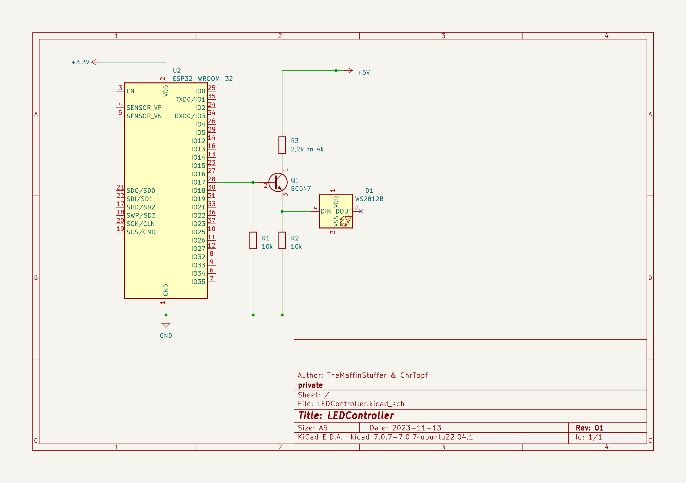
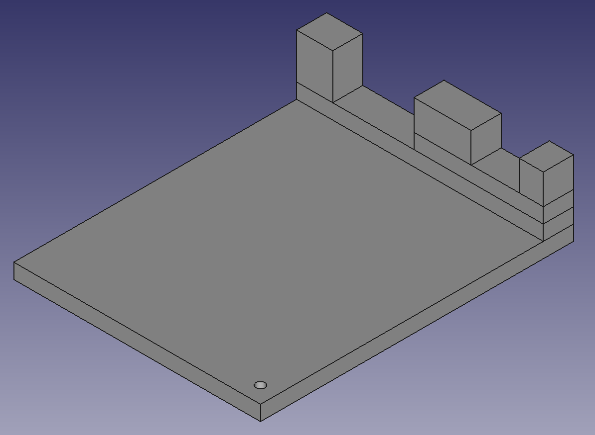

# ! Caution !

High voltage electricity can kill you! If you feel even slightly unsure how to handle mains power, let it be done by an expert! Use the following content at your own risk! This plan is provided as is, without warranty of any kind.

# Schematic

This is a generic schematic. The LED Stripe was replaced by a single LED for simplification.

# Parts List (for driving 1 Stripe)

- ESP 32 Wroom (with WLED installed)

- 2x 10kOhm resistors

- 2.2k to 4k resistor (2.2k recommended)

- BC547 Bipolar Transistor

- WS2812B ARGB LED Stripe 144LEDs per Meter

- MeanWell LRS-50-5 Power Supply 5V 10A = 50W

- 2x 1x20pin header 2.54mm

- 2x M3 10mm screws

- 2x M3 20mm screws (or 4x M3 10mm screws in total works as well)

- IEC C14 power socket

- IEC C13 to European Power Connector

- perfboard 5cm x 7cm (18 x 25 pins; 2.54mm)

- 3 pin screw terminal

- cable

- 3D printed part (model provided in this repository)

# 3D Model

The .stl File can be found [here](CaseCAD/01-Case-Compound.stl) 

# Result

